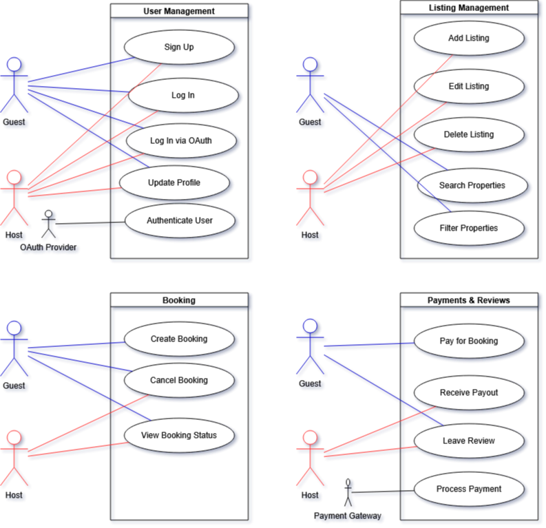

# 🧩 Use Case Diagram — Airbnb Clone

## 📌 Objective

This diagram visualizes the interactions between users and the system for key functionalities in the Airbnb Clone project. It is designed to illustrate how different actors (users, external systems) engage with core backend features such as registration, property management, bookings, and payments.

---

## 📐 Use Case Overview

The diagram captures:

- **User Registration and Login**
  - Sign up as guest or host
  - Login using email/password or OAuth (Google/Facebook)
- **Profile Management**
  - Update user details, photo, and preferences
- **Property Listings**
  - Hosts can add, edit, or delete properties
- **Search and Filtering**
  - Guests can search by location, price, amenities, and more
- **Booking Management**
  - Guests can book and cancel stays
  - Hosts can confirm or cancel bookings
- **Payment System**
  - Secure payments by guests
  - Automatic payouts to hosts via payment gateways
- **Reviews**
  - Guests review properties; hosts can respond

---

## 👥 Key Actors

- **Guest** – End-user looking to book a property
- **Host** – Property owner listing spaces
- **OAuth Provider** – External login system (Google, Facebook)
- **Payment Gateway** – Handles secure transactions (e.g., Stripe, PayPal)

---

## 🖼️ Diagram

The use case diagram is available in the following formats:

- **PNG Image**:  
  

